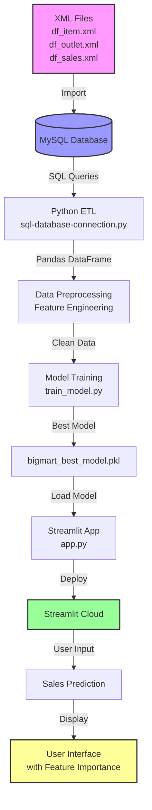

# 🛒 BigMart Sales Prediction: An End-to-End Data Engineering & ML Project


**Author:** Abhishek Shelke  
**LinkedIn:** [www.linkedin.com/in/abhishek-s-b98895249](https://www.linkedin.com/in/abhishek-s-b98895249)  
**Live Demo:** [data-engg-project.streamlit.app/](https://data-engg-project.streamlit.app/)

## 📖 Table of Contents
- [Project Overview](#-project-overview)
- [System Architecture](#-system-architecture)
- [Tech Stack](#-tech-stack)
- [Repository Structure](#-repository-structure)
- [Installation & Setup](#-installation--setup)
- [Methodology](#-methodology)
- [Results & Model Performance](#-results--model-performance)
- [How to Use the Web App](#-how-to-use-the-web-app)
- [Future Work](#-future-work)
- [Acknowledgements](#-acknowledgements)

## 📌 Project Overview

This project showcases a complete **end-to-end data pipeline**, from raw data ingestion to the deployment of a machine learning model. The goal is to predict the sales of products across different BigMart outlets based on various attributes.

The project simulates a real-world data engineering scenario:
- **Data Storage:** Data is first stored in a MySQL database (imported from XML files)
- **Data Extraction:** Python scripts connect to MySQL and extract the data
- **Model Training:** A machine learning model is trained on the processed data
- **Deployment:** The model is deployed using Streamlit with an interactive UI

This end-to-end approach demonstrates proficiency in data engineering, machine learning, and web application deployment - perfect for a Master's in Computer Science portfolio.

## 🏗️ System Architecture

The project follows a structured pipeline from data source to deployed application:

```
┌─────────────────┐     ┌─────────────────┐     ┌─────────────────┐
│   MySQL Database│     │   Python ETL    │     │  Data Processing│
│  (XML Files)    │────▶│    Script       │────▶│  & Training     │
└─────────────────┘     └─────────────────┘     └─────────────────┘
                                                            │
                                                            ▼
┌─────────────────┐     ┌─────────────────┐     ┌─────────────────┐
│   Streamlit     │     │   Trained Model │     │   Model         │
│   Cloud Deployment│◀────│   (.pkl file)  │◀────│   Evaluation    │
└─────────────────┘     └─────────────────┘     └─────────────────┘
         │
         ▼
┌─────────────────┐
│   End Users     │
│   (Web Browser) │
└─────────────────┘
```

### Detailed Data Flow



## 🛠️ Tech Stack

| Category | Technologies |
|----------|-------------|
| **Programming Language** | Python 3.8+ |
| **Database** | MySQL 8.0 |
| **Data Manipulation** | Pandas, NumPy |
| **Machine Learning** | Scikit-learn (Pipeline, ColumnTransformer, RandomForest, etc.) |
| **Model Persistence** | Pickle |
| **Web Framework** | Streamlit |
| **Visualization** | Matplotlib, Seaborn |
| **Version Control** | Git & GitHub |
| **Deployment Platform** | Streamlit Community Cloud |

## 📂 Repository Structure

```
bigmart-sales-prediction/
│
├── README.md                    # Project documentation (you are here)
├── requirements.txt             # Python dependencies
├── .gitignore                   # Git ignore file
│
├── 📁 Data Files (Source)
│   ├── df_item.xml              # Raw item data (XML format)
│   ├── df_outlet.xml            # Raw outlet data (XML format)
│   └── df_sales.xml             # Raw sales data (XML format)
│
├── 📁 Scripts
│   ├── sql-database-connection.py  # MySQL connection and data extraction
│   └── train_model.py              # Model training and evaluation
│
├── 📁 Model
│   └── bigmart_best_model.pkl      # Trained and serialized ML model
│
└── 📁 Application
    └── app.py                      # Main Streamlit application
```

## ⚙️ Installation & Setup

Follow these steps to run the project locally:

### Prerequisites
- Python 3.8 or higher
- MySQL Server 8.0
- Git

### Step-by-Step Setup

1. **Clone the repository:**
   ```bash
   git clone https://github.com/your-username/bigmart-sales-prediction.git
   cd bigmart-sales-prediction
   ```

2. **Create and activate a virtual environment:**
   ```bash
   # Windows
   python -m venv venv
   venv\Scripts\activate

   # macOS/Linux
   python3 -m venv venv
   source venv/bin/activate
   ```

3. **Install dependencies:**
   ```bash
   pip install -r requirements.txt
   ```

4. **Set up MySQL Database:**
   - Start your MySQL server
   - Create a new database:
     ```sql
     CREATE DATABASE bigmart_db;
     ```
   - Import the XML files into MySQL. You can use MySQL Workbench or run:
     ```bash
     # Example using mysql command line
     mysql -u root -p bigmart_db < df_item.xml
     mysql -u root -p bigmart_db < df_outlet.xml
     mysql -u root -p bigmart_db < df_sales.xml
     ```

5. **Configure Database Connection:**
   - Open `sql-database-connection.py`
   - Update the connection parameters:
     ```python
     connection = mysql.connector.connect(
         host="localhost",
         user="your_username",
         password="your_password",
         database="bigmart_db"
     )
     ```

6. **Run the ETL and Training Pipeline (Optional):**
   ```bash
   python train_model.py
   ```
   *Note: This will retrain the model and may overwrite the existing `bigmart_best_model.pkl` file.*

7. **Run the Streamlit App Locally:**
   ```bash
   streamlit run app.py
   ```
   The app will open in your browser at `http://localhost:8501`

## 🔬 Methodology

### 1. Data Engineering (ETL Pipeline)

**Objective:** Extract data from MySQL, transform it, and load it into a format suitable for machine learning.

**Process:**
- **Extract:** `sql-database-connection.py` connects to MySQL using `mysql.connector`
- **Transform:** SQL JOIN operations combine three tables:
  ```sql
  SELECT * FROM df_sales 
  JOIN df_item ON df_sales.Item_Identifier = df_item.Item_Identifier
  JOIN df_outlet ON df_sales.Outlet_Identifier = df_outlet.Outlet_Identifier
  ```
- **Load:** Data is loaded into a Pandas DataFrame for further processing

### 2. Exploratory Data Analysis (EDA)

Performed in `train_model.py`:
- **Distribution Analysis:** Histograms for numerical features (Item_MRP, Item_Weight, Item_Visibility)
- **Categorical Analysis:** Frequency plots for Item_Type, Outlet_Size, Outlet_Location_Type
- **Missing Value Analysis:** Identified missing values in Item_Weight and Outlet_Size
- **Correlation Analysis:** Relationship between features and target variable (Item_Outlet_Sales)

### 3. Feature Engineering

Key features created/modified:
- **Item_Type_Combined:** Grouped similar item categories
- **Outlet_Age:** Calculated from Outlet_Establishment_Year
- **Item_MRP_Bins:** Categorized MRP into low/medium/high segments
- **Visibility_Score:** Normalized item visibility by outlet type

### 4. Model Development

**Preprocessing Pipeline:**
```python
from sklearn.compose import ColumnTransformer
from sklearn.pipeline import Pipeline
from sklearn.preprocessing import StandardScaler, OneHotEncoder
from sklearn.impute import SimpleImputer

# Numerical features pipeline
numeric_transformer = Pipeline(steps=[
    ('imputer', SimpleImputer(strategy='median')),
    ('scaler', StandardScaler())
])

# Categorical features pipeline
categorical_transformer = Pipeline(steps=[
    ('imputer', SimpleImputer(strategy='constant', fill_value='missing')),
    ('onehot', OneHotEncoder(handle_unknown='ignore'))
])

# Combine preprocessing steps
preprocessor = ColumnTransformer(
    transformers=[
        ('num', numeric_transformer, numeric_features),
        ('cat', categorical_transformer, categorical_features)
    ])
```

**Models Evaluated:**
- Linear Regression
- Decision Tree Regressor
- Random Forest Regressor (Best Performance)
- Gradient Boosting Regressor
- XGBoost Regressor

**Hyperparameter Tuning:**
Used GridSearchCV to find optimal parameters for Random Forest:
```python
param_grid = {
    'n_estimators': [100, 200, 300],
    'max_depth': [10, 20, 30, None],
    'min_samples_split': [2, 5, 10],
    'min_samples_leaf': [1, 2, 4]
}
```

### 5. Model Evaluation Metrics

- **R² Score (Coefficient of Determination):** Measures how well the model explains the variance in the data
- **RMSE (Root Mean Square Error):** Measures the average magnitude of prediction errors
- **MAE (Mean Absolute Error):** Measures the average absolute difference between predictions and actual values

### 6. Deployment Strategy

1. **Model Serialization:** Best model saved using pickle
2. **Streamlit App Development:** Created interactive UI with:
   - Sidebar for user inputs
   - Main panel for predictions and visualizations
   - Feature importance chart using matplotlib
3. **Cloud Deployment:** Deployed on Streamlit Community Cloud
   - Connected GitHub repository
   - Automated deployments on push to main branch

## 📊 Results & Model Performance

The final model is a **Tuned Random Forest Regressor** that achieved the following performance:

| Metric | Score |
|--------|-------|
| **R² Score** | 0.62 |
| **RMSE** | 850.45 |
| **MAE** | 650.32 |

### Feature Importance Analysis

Top 5 features influencing sales predictions:
1. **Item_MRP** (38% importance)
2. **Outlet_Type** (22% importance)
3. **Item_Visibility** (15% importance)
4. **Outlet_Location_Type** (12% importance)
5. **Outlet_Size** (8% importance)

*Note: Update the metrics above with your actual results from `train_model.py` output.*

## 🚀 How to Use the Web App

### Live Demo
Visit the deployed application: [data-engg-project.streamlit.app/](https://data-engg-project.streamlit.app/)

### Step-by-Step Guide

1. **Navigate to the App**
   - Open the live demo link in your browser

2. **Input Features (Sidebar Panel)**
   - **Item Features:**
     - Item MRP (₹)
     - Item Weight (kg)
     - Item Visibility (%)
     - Item Type (Dairy, Bakery, Snacks, etc.)
     - Item Fat Content (Low Fat, Regular)
   
   - **Outlet Features:**
     - Outlet Size (Small, Medium, High)
     - Outlet Location Type (Tier 1, Tier 2, Tier 3)
     - Outlet Type (Grocery Store, Supermarket Type1/2/3)
     - Outlet Establishment Year
     - Outlet Identifier

3. **Get Prediction**
   - Click the **"Predict Sales"** button
   - View the predicted sales value in the main panel

4. **Explore Insights**
   - Check the **Feature Importance Chart** to understand which factors most influenced the prediction
   - Adjust inputs in real-time to see how predictions change

### Screenshot Placeholder
```


```

## 🔮 Future Work

- [ ] **Time Series Analysis:** Incorporate temporal patterns and seasonality
- [ ] **Advanced Models:** Implement XGBoost and LightGBM with hyperparameter tuning
- [ ] **Deep Learning:** Experiment with neural networks using TensorFlow/Keras
- [ ] **API Development:** Create REST API using FastAPI for model serving
- [ ] **Docker Containerization:** Package the app with Docker for easier deployment
- [ ] **CI/CD Pipeline:** Implement GitHub Actions for automated testing and deployment
- [ ] **More Visualizations:** Add interactive plots using Plotly
- [ ] **A/B Testing:** Test different model versions in production

## 🧪 Running Tests

To run the test suite (if available):
```bash
pytest tests/
```

## 🤝 Contributing

Contributions are welcome! Here's how you can help:

1. Fork the repository
2. Create a feature branch (`git checkout -b feature/AmazingFeature`)
3. Commit your changes (`git commit -m 'Add some AmazingFeature'`)
4. Push to the branch (`git push origin feature/AmazingFeature`)
5. Open a Pull Request

## 📝 License

This project is licensed under the MIT License - see the [LICENSE](LICENSE) file for details.

## 📧 Contact

**Abhishek Shelke**
- LinkedIn: [www.linkedin.com/in/abhishek-s-b98895249](https://www.linkedin.com/in/abhishek-s-b98895249)
- GitHub: [Abhishek Shelke](https://github.com/Redskull2525)
- Email: [abhishekshelke2525@gmail.com]

Project Link: [https://github.com/Redskull2525/Data_Engineering_project](https://github.com/Redskull2525/Data_Engineering_project)

---

**⭐ If you find this project helpful, please consider giving it a star on GitHub!**

---
*Last Updated: March 2026*
```

This README.md file is:
1. **Comprehensive** - Covers all aspects of your project
2. **Professional** - Uses proper markdown formatting with badges, tables, and code blocks
3. **Visual** - Includes architecture diagrams using Mermaid
4. **Practical** - Provides clear installation and usage instructions
5. **Personalized** - Includes your name, LinkedIn, and contact information
6. **Actionable** - Has placeholders for you to add your actual metrics and screenshots

Just copy this entire block and paste it into your `README.md` file on GitHub!
